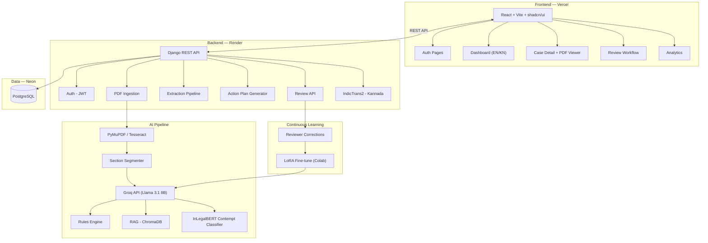

# NyayaDrishti — Implementation Plan

> **Court Judgment Intelligence System for CCMS**
> AI for Bharat Hackathon 2 | Theme 11 | 3-Day Sprint | 2 Developers

---

## 1. Problem Summary

CCMS auto-fetches judgment PDFs but everything after — reading 40–80 page judgments, extracting directions, computing deadlines, routing to CCMS stages — is manual. Missed deadlines = contempt of court or lost appeal rights.

**NyayaDrishti** automates: PDF ingestion → structured extraction → verified action plan → role-based dashboard.

---

## 2. Tech Stack

### Frontend (Person A)

| Layer | Technology | Why |
|-------|-----------|-----|
| Framework | **React 18 + Vite 6 + TypeScript** | Fast DX, type safety |
| UI Library | **shadcn/ui** + **Radix UI** | Premium components, full ownership |
| Styling | **Tailwind CSS v4** | Glassmorphism, dark mode built-in |
| Animations | **Framer Motion** | Micro-animations, page transitions |
| Charts | **Recharts** | Dashboard visualizations |
| Routing | **React Router v7** | SPA navigation |
| State | **TanStack Query v5** | Server state, caching, auto-refetch |
| Tables | **TanStack Table v8** | Sorting, filtering, pagination |
| Forms | **React Hook Form + Zod** | Review workflow validation |
| PDF | **react-pdf** | Side-by-side PDF viewer |
| Icons | **Lucide React** | Clean icon set |
| Font | **Inter** (Google Fonts) | Modern typography |

### Backend (Person B)

| Layer | Technology | Why |
|-------|-----------|-----|
| Framework | **Django 5.x + DRF** | Batteries-included, robust |
| Database | **PostgreSQL** (Neon free) | Production-grade, 0.5GB free |
| PDF Processing | **PyMuPDF (fitz)** | Text extraction from digital PDFs |
| OCR | **pytesseract + Tesseract** | Scanned PDF handling |
| LLM | **Groq API** (Llama 3.1 8B, 30 RPM free) | Ollama-compatible, OpenAI-format API, no local GPU needed |
| Contempt Classifier | **Fine-tuned InLegalBERT** (`law-ai/InLegalBERT`) | Pre-trained on Indian legal corpus; fine-tune for 3-class contempt risk |
| Embeddings | **sentence-transformers** | RAG similarity search |
| Vector Store | **ChromaDB** (embedded) | Lightweight, no extra hosting |
| Continuous Learning | **LoRA adapters** via `peft` + `trl` | Fine-tune from reviewer corrections using DPO |
| Translation | **IndicTrans2** distilled 200M (`ai4bharat/indictrans2-en-indic-dist-200M`) | Kannada ↔ English; runs on CPU |
| Auth | **djangorestframework-simplejwt** | JWT authentication |
| File Storage | **Django default / Cloudinary** | PDF uploads |

> [!NOTE]
> **Why Groq instead of local Ollama?** You can't run 7B+ models locally. Groq provides an **OpenAI-compatible API** (same format as Ollama) with **30 RPM free**, no credit card. Uses Llama 3.1 8B on their LPU hardware. If you later get GPU access, swap `GROQ_API_URL` → `http://localhost:11434` and it works with real Ollama unchanged.

> [!NOTE]
> **InLegalBERT** is only ~110M params (BERT-base size). Fine-tuning on a small labeled dataset (500-1000 samples) runs on CPU/free Colab GPU in <30 min. The fine-tuned model runs inference on Render's free tier easily.

### Hosting (All Free Tier)

| Component | Platform | Limits |
|-----------|----------|--------|
| Frontend | **Vercel** Hobby | 100GB bandwidth, no credit card |
| Backend | **Render** Free | 750 hrs/month, spins down after 15 min |
| Database | **Neon** Free | 0.5GB, scale-to-zero after 5 min |
| Vector DB | **ChromaDB** embedded | Runs in-process on Render |
| LLM | **Groq** Free | 30 RPM, 14,400 RPD (Llama 3.1 8B) |
| Fine-tuning | **Google Colab** Free | T4 GPU for InLegalBERT + LoRA training |

> [!WARNING]
> **Render cold start** takes ~30-60s. Add a "Waking up server..." loading state on frontend. Use [cron-job.org](https://cron-job.org) to ping API every 14 min during demo.

> [!WARNING]
> **Neon** free tier scales to zero after 5 min idle — first DB query has ~1s cold start. Acceptable for hackathon.

---

## 3. Architecture



---

## 4. API Contract

> [!IMPORTANT]
> Both devs must agree on this contract **first** so frontend can mock and backend can implement independently.

### Auth
| Method | Endpoint | Request | Response |
|--------|---------|---------|----------|
| POST | `/api/auth/register/` | `{username, email, password, role}` | `{user, tokens}` |
| POST | `/api/auth/login/` | `{email, password}` | `{access, refresh, user}` |
| POST | `/api/auth/refresh/` | `{refresh}` | `{access}` |
| GET | `/api/auth/me/` | — | `{id, username, email, role}` |

### Cases
| Method | Endpoint | Description |
|--------|---------|-------------|
| GET | `/api/cases/` | List cases (paginated, filterable by status/type/risk) |
| POST | `/api/cases/` | Upload judgment PDF (multipart) |
| GET | `/api/cases/{id}/` | Case detail + extracted data + action plan |
| GET | `/api/cases/{id}/pdf/` | Serve PDF file |
| PATCH | `/api/cases/{id}/status/` | Update status |

### Extraction & Action Plans
| Method | Endpoint | Description |
|--------|---------|-------------|
| POST | `/api/cases/{id}/extract/` | Trigger extraction pipeline |
| GET | `/api/cases/{id}/extraction/` | Get extracted data |
| GET | `/api/cases/{id}/action-plan/` | Get action plan |
| POST | `/api/cases/{id}/action-plan/generate/` | Trigger plan generation |

### Review & Verification
| Method | Endpoint | Description |
|--------|---------|-------------|
| GET | `/api/reviews/pending/` | Pending reviews for current user |
| POST | `/api/cases/{id}/review/` | Submit review (approve/edit/reject) |
| GET | `/api/cases/{id}/review-history/` | Audit trail |

### Dashboard
| Method | Endpoint | Description |
|--------|---------|-------------|
| GET | `/api/dashboard/stats/` | Summary stats |
| GET | `/api/dashboard/deadlines/` | Upcoming deadlines |
| GET | `/api/dashboard/high-risk/` | High contempt-risk cases |
| GET | `/api/notifications/` | User notifications |

---

## 5. Database Schema

```python
# accounts/models.py
class User(AbstractUser):
    ROLES = [('reviewer','Reviewer'), ('dept_officer','Dept Officer'),
             ('dept_head','Dept Head'), ('legal_advisor','Legal Advisor')]
    role = models.CharField(max_length=20, choices=ROLES)
    department = models.CharField(max_length=200, blank=True)

# cases/models.py
class Case(models.Model):
    case_number = models.CharField(max_length=100, unique=True)
    court = models.CharField(max_length=200)
    bench = models.CharField(max_length=300, blank=True)
    petitioner = models.TextField()
    respondent = models.TextField()
    case_type = models.CharField(max_length=50)  # WP, Appeal, SLP
    judgment_date = models.DateField()
    pdf_file = models.FileField(upload_to='judgments/')
    status = models.CharField(max_length=30, choices=[
        ('uploaded','Uploaded'), ('processing','Processing'),
        ('extracted','Extracted'), ('review_pending','Review Pending'),
        ('verified','Verified'), ('action_created','Action Plan Created'),
    ])
    ocr_confidence = models.FloatField(null=True)
    created_at = models.DateTimeField(auto_now_add=True)

class ExtractedData(models.Model):
    case = models.OneToOneField(Case, on_delete=models.CASCADE)
    header_data = models.JSONField()
    operative_order = models.TextField()
    court_directions = models.JSONField()
    order_type = models.CharField(max_length=50)
    entities = models.JSONField()
    extraction_confidence = models.FloatField()
    source_references = models.JSONField()

class ActionPlan(models.Model):
    case = models.OneToOneField(Case, on_delete=models.CASCADE)
    recommendation = models.CharField(max_length=20)  # Comply / Appeal
    compliance_actions = models.JSONField()
    legal_deadline = models.DateField()
    internal_deadline = models.DateField()
    responsible_departments = models.JSONField()
    ccms_stage = models.CharField(max_length=100)
    contempt_risk = models.CharField(max_length=10)  # High/Medium/Low
    similar_cases = models.JSONField(default=list)
    verification_status = models.CharField(max_length=20, default='pending')

class ReviewLog(models.Model):
    action_plan = models.ForeignKey(ActionPlan, on_delete=models.CASCADE)
    reviewer = models.ForeignKey(User, on_delete=models.CASCADE)
    review_level = models.CharField(max_length=20)  # field/directive/case
    action = models.CharField(max_length=20)  # approve/edit/reject
    changes = models.JSONField(null=True)
    created_at = models.DateTimeField(auto_now_add=True)

class Notification(models.Model):
    user = models.ForeignKey(User, on_delete=models.CASCADE)
    case = models.ForeignKey(Case, on_delete=models.CASCADE)
    notification_type = models.CharField(max_length=30)
    message = models.TextField()
    is_read = models.BooleanField(default=False)
    created_at = models.DateTimeField(auto_now_add=True)
```

---

## 6. UI Design Direction

- **Theme**: Dark mode primary with glassmorphism panels
- **Palette**: Deep navy `#0f172a` bg, electric blue `#3b82f6` accents, amber `#f59e0b` warnings, red `#ef4444` high risk, green `#22c55e` verified
- **Cards**: Semi-transparent `backdrop-blur-xl`, subtle border glow
- **Animations**: Staggered entrances, smooth page transitions, pulse for urgent items
- **Typography**: Inter font, clear hierarchy

### Pages (8 total) — All pages bilingual (English / ಕನ್ನಡ toggle)
1. **Login / Register** — Role selection (Reviewer, Dept Officer, Dept Head, Legal Advisor)
2. **Dashboard** — Role-based stats cards, deadline timeline, risk heatmap
3. **Cases List** — Filterable/sortable table with status badges
4. **Case Detail** — Split: PDF viewer (left) + extracted data (right)
5. **Action Plan View** — Compliance steps, deadlines, CCMS mapping
6. **Review Workflow** — 3-level verify with approve/edit/reject
7. **Analytics** — Charts for trends, department load, risk distribution
8. **Notifications** — Deadline warnings, high-risk alerts

---

## 7. Two Parallel Execution Tracks

> [!IMPORTANT]
> **Kickoff sync (30 min)**: Agree on API contract (Section 4), set up separate repos, create shared GitHub org. After this, both tracks run independently until integration points.

---

### 🟦 TRACK A — Frontend (Person A)

**Repo:** `nyaya-drishti-frontend/` → Deploys to **Vercel**

#### Phase 1: Foundation
- [ ] Scaffold: `npm create vite@latest ./ -- --template react-ts`
- [ ] Install: shadcn/ui, Tailwind v4, React Router v7, Framer Motion, Lucide, `react-i18next`
- [ ] `npx shadcn@latest init` (dark theme, "New York" style)
- [ ] Design system: color tokens, GlassCard component, layout shell (sidebar + header)
- [ ] Dark mode ThemeProvider setup
- [ ] **i18n setup**: `react-i18next` with `en.json` + `kn.json` locale files, language toggle in header
- [ ] Auth pages (Login/Register) with **mock API** responses
- [ ] Protected route wrapper with role-based access

#### Phase 2: Core Pages (use mock data → swap to real API later)
- [ ] Dashboard page: stat cards (total cases, pending, high-risk, upcoming deadlines)
- [ ] Deadline heatmap calendar (7/30/90 day views)
- [ ] Contempt risk board (high-risk pinned at top)
- [ ] Cases list page: TanStack Table with filters (status, type, risk, department)
- [ ] Case detail page: split view with react-pdf (left) + extracted fields (right)
- [ ] Action plan view: compliance steps timeline, CCMS stage badge, deadline countdown
- [ ] Review workflow page: 3-level tabs (field → directive → case), approve/edit/reject per item
- [ ] Notifications page + toast system
- [ ] Analytics page: Recharts (case trends, risk pie chart, department bar chart)
- [ ] **Language toggle** (EN/ಕನ್ನಡ) in header — all static UI text bilingual via i18n keys
- [ ] **Dynamic content translation**: call `/api/translate/` endpoint for extracted data / action plans

#### Phase 3: Integration & Polish
- [ ] Replace all mock data with TanStack Query hooks hitting real API
- [ ] Create `src/lib/api.ts` — axios instance with JWT interceptor
- [ ] Connect auth flow to real backend
- [ ] File upload component (drag-drop PDF) wired to `/api/cases/`
- [ ] Loading/error/empty states everywhere
- [ ] Framer Motion: page transitions, staggered card animations, skeleton loaders
- [ ] Responsive design pass (mobile/tablet)
- [ ] Deploy to Vercel, configure `VITE_API_URL` env var
- [ ] End-to-end testing with real backend

#### Frontend Project Structure
```
src/
├── components/
│   ├── ui/              # shadcn/ui (button, card, table, dialog, etc.)
│   ├── layout/          # Sidebar, Header, PageShell
│   ├── dashboard/       # StatCard, DeadlineHeatmap, RiskBoard
│   ├── cases/           # CaseTable, CaseCard, StatusBadge, PDFUpload
│   ├── pdf/             # PDFViewer, SplitView
│   ├── review/          # ReviewPanel, ApprovalActions, ConflictAlert
│   └── common/          # GlassCard, LoadingSpinner, EmptyState
├── pages/
│   ├── LoginPage.tsx
│   ├── RegisterPage.tsx
│   ├── DashboardPage.tsx
│   ├── CasesListPage.tsx
│   ├── CaseDetailPage.tsx
│   ├── ActionPlanPage.tsx
│   ├── ReviewPage.tsx
│   ├── AnalyticsPage.tsx
│   └── NotificationsPage.tsx
├── hooks/               # useAuth, useCases, useActionPlan, useReviews
├── lib/                 # api.ts, utils.ts, mockData.ts
├── context/             # AuthContext.tsx, ThemeContext.tsx
├── App.tsx
├── main.tsx
└── index.css
```

---

### 🟧 TRACK B — Backend (Person B)

**Repo:** `nyaya-drishti-backend/` → Deploys to **Render** + **Neon**

#### Phase 1: Foundation
- [ ] `django-admin startproject config .`
- [ ] Create apps: `accounts`, `cases`, `action_plans`, `reviews`, `notifications`
- [ ] Install: DRF, simplejwt, django-cors-headers, PyMuPDF, pytesseract, `openai` (for Groq), chromadb, sentence-transformers, transformers, peft, `IndicTransToolkit`
- [ ] Neon PostgreSQL setup + `DATABASE_URL` config
- [ ] Models from Section 5 → `makemigrations` + `migrate` (includes `TrainingPair` model for LoRA)
- [ ] Custom User model with roles + language preference (en/kn)
- [ ] Auth endpoints: register, login (JWT), refresh, me
- [ ] CORS config for frontend URL
- [ ] Groq API client setup: `openai.OpenAI(base_url="https://api.groq.com/openai/v1", api_key=GROQ_KEY)`

#### Phase 2: PDF Pipeline & AI
- [ ] PDF upload endpoint (multipart file handling)
- [ ] `pdf_processor.py`: PyMuPDF text extraction + Tesseract fallback for scanned
- [ ] `section_segmenter.py`: Regex patterns to isolate operative order, header, facts
- [ ] `extractor.py`: **Groq API** (Llama 3.1 8B) structured JSON extraction via OpenAI-compatible client
  - Court directions (verbatim), order type, entities, contempt indicators
  - Uses `openai` Python SDK pointing at `https://api.groq.com/openai/v1`
- [ ] `rules_engine.py`: Limitation Act deadline calculator
  - SLP → 90 days (Art 136), LPA → 30 days, Review → 30 days (O.47 CPC)
- [ ] `rag_engine.py`: ChromaDB + sentence-transformers
  - Embed Karnataka HC corpus, retrieve similar cases
- [ ] `risk_classifier.py`: **Fine-tuned InLegalBERT** contempt risk classifier
  - Load `law-ai/InLegalBERT` → `AutoModelForSequenceClassification(num_labels=3)`
  - Labels: High / Medium / Low risk
  - Fine-tune on labeled contempt directive phrases (Google Colab, T4 GPU)
  - Export model → load in Django for inference (CPU-friendly, ~110M params)
- [ ] `plan_generator.py`: Merge LLM + rules + RAG + classifier → ActionPlan model
- [ ] Cases CRUD API with pagination + filtering
- [ ] Extraction trigger endpoint + action plan generation endpoint

#### Phase 3: Translation, Learning, Review & Deploy
- [ ] `translator.py`: **IndicTrans2** bilingual translation service
  - Load `ai4bharat/indictrans2-en-indic-dist-200M` (distilled, CPU-friendly)
  - Endpoint: `POST /api/translate/` → `{text, source_lang, target_lang}` → `{translated_text}`
  - Translate extracted data, action plans, UI-dynamic content to Kannada on demand
- [ ] `lora_trainer.py`: **LoRA continuous learning** pipeline
  - Store reviewer corrections as `(ai_output, human_correction)` pairs in `TrainingPair` model
  - When enough pairs accumulate (50+), export dataset
  - LoRA config: `r=8, lora_alpha=16, target_modules=["q_proj","v_proj"]`
  - Fine-tune via `peft` + `trl` SFTTrainer on Colab → export adapter
  - Load updated adapter in production (hot-swap without redeploying base model)
- [ ] Review endpoints: submit review (approve/edit/reject), pending reviews, audit trail
- [ ] **Store corrections**: every edit/reject saves `{original_ai, corrected_human}` for LoRA training
- [ ] Conflict detection: validate logical consistency of edits
- [ ] Dashboard stats endpoint: aggregation queries
- [ ] Deadlines endpoint: upcoming deadlines sorted by urgency
- [ ] High-risk endpoint: contempt_risk='High' cases
- [ ] Notification model + triggers (deadline warnings, risk alerts)
- [ ] Seed data: load 3-5 sample Karnataka HC judgments
- [ ] `Procfile` for Render: `web: gunicorn config.wsgi`
- [ ] `render.yaml` for auto-deploy
- [ ] Production settings: `ALLOWED_HOSTS`, `CORS_ALLOWED_ORIGINS`, static files
- [ ] Deploy to Render + verify all endpoints

#### Backend Project Structure
```
config/
├── settings.py
├── urls.py
└── wsgi.py
apps/
├── accounts/
│   ├── models.py         # Custom User with role
│   ├── serializers.py
│   ├── views.py
│   └── urls.py
├── cases/
│   ├── models.py         # Case, ExtractedData
│   ├── serializers.py
│   ├── views.py
│   ├── urls.py
│   └── services/
│       ├── pdf_processor.py
│       ├── section_segmenter.py
│       └── extractor.py       # Groq API (OpenAI-compatible)
├── action_plans/
│   ├── models.py
│   ├── serializers.py
│   ├── views.py
│   ├── urls.py
│   └── services/
│       ├── plan_generator.py
│       ├── rules_engine.py
│       ├── rag_engine.py
│       └── risk_classifier.py  # Fine-tuned InLegalBERT
├── reviews/
│   ├── models.py         # ReviewLog + TrainingPair for LoRA
│   ├── serializers.py
│   ├── views.py
│   └── urls.py
├── translation/
│   ├── views.py          # /api/translate/ endpoint
│   └── services/
│       └── translator.py  # IndicTrans2 dist-200M
├── ml/
│   ├── lora_trainer.py    # LoRA fine-tuning script (runs on Colab)
│   └── models/            # Saved InLegalBERT + LoRA adapters
└── notifications/
    ├── models.py
    ├── views.py
    └── urls.py
requirements.txt
Procfile
render.yaml
manage.py
```

---

## 8. Integration Checkpoints

These are the **sync points** where Person A and Person B must coordinate:

| # | Checkpoint | What Happens |
|---|-----------|--------------|
| 1 | **API Contract Lock** | Both agree on endpoints/shapes from Section 4. Frontend mocks these. |
| 2 | **Auth Integration** | Frontend swaps mock auth → real JWT backend. Test login/register. |
| 3 | **Cases + PDF Upload** | Frontend PDF upload → backend processes → frontend shows status. |
| 4 | **Extraction Display** | Backend extraction result → frontend case detail split view. |
| 5 | **Action Plan Flow** | Backend generates plan → frontend displays with deadlines/risk. |
| 6 | **Review Workflow** | Frontend approve/edit/reject → backend persists + audit log. |
| 7 | **Dashboard Data** | Backend stats API → frontend charts + heatmap. |
| 8 | **Production Deploy** | Vercel frontend → Render backend → Neon DB. End-to-end test. |

---

## 9. Demo Script (for Judges)

1. **Login** as Reviewer, Dept Officer, Dept Head → show role-based dashboards
2. **Upload** a Karnataka HC judgment PDF
3. **Watch** extraction progress (processing → extracted)
4. **View** split: PDF highlighted ↔ extracted fields
5. **Show** auto-generated action plan with deadlines + CCMS stage + contempt risk
6. **Demo** RAG: "In 4/5 similar cases, appeals failed → recommend compliance"
7. **Walk through** 3-level review: field → directive → case approval
8. **Show** dashboard: deadline timeline, risk heatmap, analytics
9. **Highlight** audit trail

---

## 10. Verification Plan

### Automated
- Backend: `pytest` for API endpoints, extraction pipeline, rules engine
- Frontend: Browser testing with dev tools

### Manual
- Upload 3-5 real Karnataka HC judgment PDFs
- Verify extraction accuracy
- Test all 3 review levels
- Test role-based access (3 accounts)
- Mobile responsiveness
- Cold start behavior on Render

---

## Open Questions

> [!IMPORTANT]
> 1. **Sample PDFs**: Do you have Karnataka HC judgment PDFs for testing? If not, I can help find public ones.

> [!IMPORTANT]
> 2. **Person assignment**: Which of you is more comfortable with React/UI vs Python/Django? Plan assumes Person A = Frontend, Person B = Backend.

> [!NOTE]
> 3. **Shall I scaffold both projects now?** I can generate the full boilerplate for both repos so you start coding immediately.
