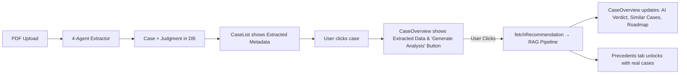

# Frontend-Backend Integration Plan — NyayaDrishti Dashboard

## Goal

Integrate the backend LLM Extractor JSON + RAG Recommendation JSON into the frontend dashboard so that government officers can see: a clean case summary, AI action plan, source-highlighted PDF, precedents from 20-year corpus, and risk assessment — all flowing from real data.

---

## Current State Analysis

### What's Working ✅
| Layer | Status |
|-------|--------|
| **PDF Upload → Extraction** | Working. `POST /api/cases/extract/` runs 4-agent LLM extraction and saves to DB |
| **Case List** | Working. Fetches from `/api/cases/` and renders real data |
| **Case Detail Fetch** | Working. `fetchCase(id)` returns full `CaseData` with nested `JudgmentData` |
| **Source Location Annotation** | Working. `_annotate_source_locations()` finds PDF bounding boxes for directives |
| **Serve PDF** | Working. `GET /api/cases/judgments/{id}/pdf/` serves the uploaded PDF |

### What's Broken / Not Connected ❌
| Component | Problem |
|-----------|---------|
| **Case Title** | Shows raw party names like "Narendra Babu G.V., Yallappa Bagali, Vani R S, Chaitra A.J...." — too long, needs truncation |
| **Precedents Tab** | Uses hardcoded mock data (ABC Corp, Nexus Systems) instead of the real RAG recommendation API |
| **CaseOverview → AI Recommendation** | Shows `disposition` from extractor but NOT the RAG pipeline's APPEAL/COMPLY verdict |
| **Verify Actions → PDF Viewer** | Shows hardcoded "Supreme Court of India" placeholder text instead of the **actual PDF** |
| **Action Plan on sidebar** | Shows "No verified actions yet" — not connected to the `action_plan` field from the recommendation pipeline |
| **Case List → Days to Deadline** | Always shows "—" — not computed from the RAG `limitation_deadline` |
| **Similar Cases table** | Shows only extractor's `outgoing_citations` (case citations), NOT the RAG retrieved precedents |
| **RAG Recommendation API call** | `Precedents.tsx` sends hardcoded `case_text` ("The petitioner filed a writ petition...") instead of real case data |

---

## Decisions Made

1. **Party Name Truncation**: We will use the legal convention `"Narendra Babu G.V. & 7 Ors. vs. State of Karnataka"`.
2. **PDF Rendering**: We will use `react-pdf` for pixel-perfect source highlighting.
3. **RAG Pipeline Timing**: We will run it on-demand. Users will click a "Generate AI Analysis" button. 
    *   **Pre-Analysis State**: When entering the dashboard before running the analysis, users will see the extracted metadata (Case Details, Executive Brief, Verify Actions). The "AI Recommendation", "Similar Cases", and "Precedents" tab will show an empty state: "AI Analysis pending. Click 'Generate AI Analysis' to evaluate precedents and risks."

---

## Proposed Changes

### Component 1: Backend — New Unified Recommendation Endpoint

#### [MODIFY] [views.py](file:///c:/Users/HARSH%20MOHTA/OneDrive%20-%20iiit-b/Desktop/Nyaya-Drishti/backend/apps/action_plans/views.py)
- Modify `GenerateRecommendationView` to accept a `case_id` (DB UUID) and auto-load the case text, area_of_law, court, disposition, bench, parties, and issues from the DB.
- Add endpoint logic to fetch cached recommendations if they exist, or trigger generation.

#### [MODIFY] [serializers.py](file:///c:/Users/HARSH%20MOHTA/OneDrive%20-%20iiit-b/Desktop/Nyaya-Drishti/backend/apps/cases/serializers.py)
- Add `bench` field to CaseSerializer.

---

### Component 2: Frontend — Case List Fixes

#### [MODIFY] [CaseList.tsx](file:///c:/Users/HARSH%20MOHTA/OneDrive%20-%20iiit-b/Desktop/Nyaya-Drishti/frontend/src/components/CaseList.tsx)
1. **Truncate party names**: Implement logic to format as `"X & N Ors. vs. Y"`.
2. **Case Number**: Use `case_number` from extractor.
3. **Days to Deadline**: Compute from `judgment.court_directions[0].deadline` or RAG `limitation_deadline`.
4. **Status**: Add an "Analysis Pending" status indicator if the RAG pipeline hasn't been run.

---

### Component 3: Frontend — Case Overview (The Main Dashboard)

#### [MODIFY] [CaseOverview.tsx](file:///c:/Users/HARSH%20MOHTA/OneDrive%20-%20iiit-b/Desktop/Nyaya-Drishti/frontend/src/components/CaseOverview.tsx)
1. **Case Details Card**: Add Bench, Date of Order, Area of Law, Primary Statute.
2. **On-Demand Generation UI**: Add a prominent "Generate AI Analysis" button if no recommendation exists. Show a processing state with phases ("Finding Precedents...", "Analyzing Legal Risk...", etc.) while it runs.
3. **AI Recommendation Card**: Show RAG output (APPEAL/COMPLY, Confidence, Urgency, Primary Reasoning, Contempt Risk) *after* generation.
4. **Similar Cases Table**: Replace extractor-citations with RAG precedents *after* generation.
5. **Compliance Roadmap**: Display `recommendation.action_plan`.

---

### Component 4: Frontend — Verify Actions (PDF Source Highlighting)

#### [MODIFY] [VerifyActions.tsx](file:///c:/Users/HARSH%20MOHTA/OneDrive%20-%20iiit-b/Desktop/Nyaya-Drishti/frontend/src/components/VerifyActions.tsx)
1. **Install and integrate `react-pdf`**.
2. **Fetch and render actual PDF** using the backend PDF URL.
3. **Map real action items** from `judgment.court_directions`.
4. **Implement Source Highlighting**: Use `source_location` bounding boxes `(x0, y0, x1, y1)` to draw highlight overlays over the PDF canvas when an action is clicked.

---

### Component 5: Frontend — Precedents Tab

#### [MODIFY] [Precedents.tsx](file:///c:/Users/HARSH%20MOHTA/OneDrive%20-%20iiit-b/Desktop/Nyaya-Drishti/frontend/src/components/Precedents.tsx)
1. **Empty State**: Show "Generate AI Analysis" button if not run yet.
2. **Render real PrecedentCards** from RAG response.
3. **Remove mock sidebar elements** and replace with Agent Signal Summary.

---

### Component 6: Frontend — API Client Updates

#### [MODIFY] [client.ts](file:///c:/Users/HARSH%20MOHTA/OneDrive%20-%20iiit-b/Desktop/Nyaya-Drishti/frontend/src/api/client.ts)
1. Update `apiGetRecommendation` and add `apiGenerateRecommendation`.
2. Add PDF fetching logic if needed for `react-pdf`.

---

### Component 7: Frontend — App.tsx State Management

#### [MODIFY] [App.tsx](file:///c:/Users/HARSH%20MOHTA/OneDrive%20-%20iiit-b/Desktop/Nyaya-Drishti/frontend/src/App.tsx)
1. Manage `recommendation` state.
2. Provide handlers for triggering the generation process.

---

## Data Flow Diagram

