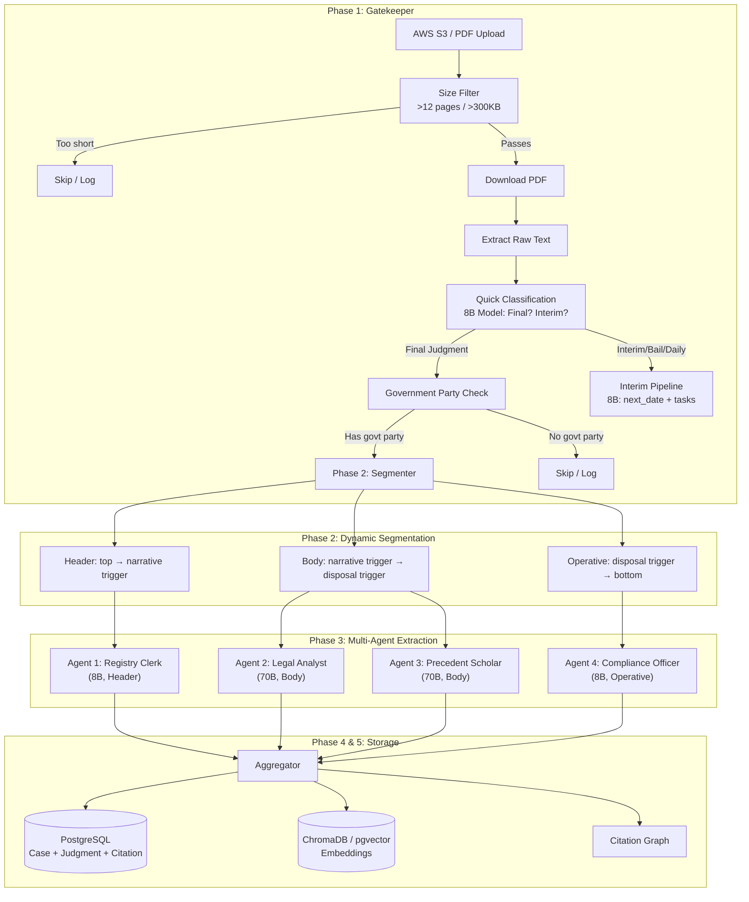
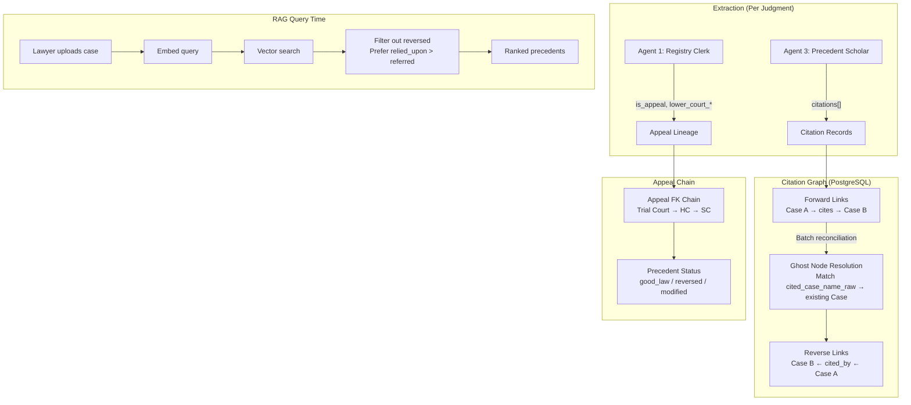

# NyayaDrishti Pipeline Redesign — Implementation Plan

## Goal

Replace the current fragile, percentage-based extraction pipeline with a production-grade multi-agent system that delivers high-fidelity legal data for RAG-powered precedent retrieval and appeal strategy generation.

## User Review Required

> [!IMPORTANT]
> **LLM Provider Choice**: The plan uses NVIDIA NIM (Llama 3.1 8B + 70B). The free tier allows ~1000 RPM for 8B and ~100 RPM for 70B. Agents 1 & 4 (8B) can run very fast; Agents 2 & 3 (70B) need rate limiting. Should we add Groq as a fallback for 8B calls (faster, 30 RPM free)?

> [!WARNING]
> **Breaking Migration**: Phase 3 changes the Citation model to add `citation_ref` and restructures `raw_extracted_json`. Existing data will need a `--full-reset` after deployment. This is fine since we're still in development.

> [!IMPORTANT]
> **Async vs Sequential**: NVIDIA free tier can handle 2 parallel 8B calls but only 1 concurrent 70B call. The plan runs Agents 1+4 (8B) in parallel first, then Agents 2+3 (70B) sequentially with 30s sleep between them. True async parallelism would need a paid tier. Is this acceptable?

## Open Questions

1. **Data Source**: The AWS S3 bucket has only 64 PDFs over 500KB in the Karnataka bench. Should we also scrape from Indian Kanoon (has richer, longer SC/HC judgments) or is AWS sufficient for the hackathon demo?

2. **pgvector vs ChromaDB**: Current system uses ChromaDB (local, zero-config). Your plan mentions pgvector/Pinecone. For the hackathon, should we keep ChromaDB (simpler) or migrate to pgvector (more production-ready, already have PostgreSQL)?

3. **Interim Order Routing**: You want interim/bail/daily orders to bypass RAG and go to an 8B model for quick extraction. Should this be a separate Django management command (e.g., `process_interim`) or integrated into the same `populate_rag` command with routing logic?

---

## Architecture Overview



---

## Phase 1: The Ingestion & Filtering Gatekeeper

### Current State
- Size filter exists (`--min-size` flag, default 100KB)
- Government filter exists (`--gov-only` flag)
- No document type classification (Final vs Interim)
- No routing for interim orders

### Proposed Changes

#### [MODIFY] [populate_rag.py](file:///c:/Users/HARSH%20MOHTA/OneDrive%20-%20iiit-b/Desktop/Nyaya-Drishti/backend/apps/action_plans/management/commands/populate_rag.py)

**Gatekeeper logic (before any LLM calls):**

```python
# Step 1: Size filter (already exists — change default to 300KB for ~12+ pages)
DEFAULT_MIN_SIZE_KB = 300

# Step 2: Text extraction + page count validation
text = extract_text_from_pdf(pdf_path)
page_estimate = len(text) // 3000  # ~3000 chars per page
if page_estimate < 12:
    log("SKIP: Only {page_estimate} pages — likely interim order")
    return False

# Step 3: Quick 8B classification (new — single cheap call)
doc_type = _classify_document_type(text[:2000] + text[-2000:])
# Returns: "final_judgment" | "interim_order" | "bail_order" | "daily_order"

if doc_type != "final_judgment":
    if route_interim:
        _process_interim_order(text, pdf_path)  # 8B quick extraction
    return False

# Step 4: Government party check (runs AFTER 8B classification)
# Extract header quickly with regex (no LLM needed for party names)
parties = _extract_parties_regex(text[:3000])
if gov_only and not _is_government_party(parties):
    log(f"SKIP: No govt party")
    return False
```

**Key improvement over current**: The government party check currently runs AFTER all 3 LLM calls complete (wasting expensive 70B calls on private-party cases). Moving it before the multi-agent pipeline saves 3 API calls per skipped case.

#### [NEW] Interim Order Quick Processor

For orders that fail the gatekeeper, extract only:
```python
{
    "case_number": str,
    "next_hearing_date": Optional[str],      # ISO date
    "immediate_tasks": list[str],             # "File reply by...", "Serve notice to..."
    "document_type": str,                     # "Interim Stay", "Bail Order", etc.
}
```
This uses a single 8B call and does NOT enter the RAG vector store.

---

## Phase 2: Dynamic Document Segmentation

### Current State (Problems)
```
Current: Percentage-based with keyword scan in last 40%
├── Header: first 2000 chars OR first _HEADER_END_RE match
├── Middle: header_end → operative_start (+ 15% overlap)
└── Operative: last _OPERATIVE_RE match in bottom 60% (+ 15% overlap)
```

**Problems:**
1. "ORDER" keyword isn't always present (some judges use "ACCORDINGLY", "FOR THESE REASONS", etc.)
2. Percentage-based search window (40%) is arbitrary — a 50-page judgment's order might start at 95%
3. Header extraction misses some formats where parties span 4-5 pages

### Proposed: Bi-directional Structural Scan

```
New: Top-down + Bottom-up structural heuristics
├── Header: Top → scan DOWN until narrative trigger
├── Body: narrative_trigger → disposal_trigger
└── Operative: Bottom → scan UP until disposal trigger
```

#### [MODIFY] [section_segmenter.py](file:///c:/Users/HARSH%20MOHTA/OneDrive%20-%20iiit-b/Desktop/Nyaya-Drishti/backend/apps/cases/services/section_segmenter.py)

**Complete rewrite with bi-directional scanning:**

```python
# NARRATIVE TRIGGERS (top-down: marks where the facts begin)
_NARRATIVE_TRIGGERS = [
    r"This (writ )?petition is filed",
    r"This appeal is filed",
    r"The (brief )?facts of the case",
    r"The petitioner has filed",
    r"The appellant (herein )?has preferred",
    r"Heard (the )?learned (counsel|senior counsel|advocate)",
    r"Having heard",
    r"The case of the (petitioner|appellant|prosecution)",
    r"The (brief )?background of the case",
    r"Sri\. .+ learned (counsel|advocate) for",  # First lawyer mention
]

# DISPOSAL TRIGGERS (bottom-up: marks where the order begins)
_DISPOSAL_TRIGGERS = [
    r"For the (foregoing|above) reasons",
    r"In view of the (above|foregoing|discussions?)",
    r"In the result",
    r"Accordingly",
    r"For these reasons",
    r"I (therefore )?pass the following",
    r"The following order is (made|passed)",
    r"\bORDER\b",  # standalone ORDER heading
    r"(Petition|Appeal|Writ petition) is (hereby )?(allowed|dismissed|disposed)",
    r"(Hence|Therefore),?\s+(this|the)\s+(petition|appeal|writ)",
]
```

**Algorithm:**
1. **Header end** (top-down): Scan first 30% of text for `_NARRATIVE_TRIGGERS`. Take the FIRST match. Fallback: 2000 chars.
2. **Operative start** (bottom-up): Scan last 50% of text for `_DISPOSAL_TRIGGERS`. Take the LAST match that appears on its own line (< 80 chars) OR the last match of "Petition/Appeal is allowed/dismissed". Fallback: last 25% of text.
3. **Body**: Everything between header_end and operative_start.
4. **Overlap**: 10% bidirectional (body extends into operative zone, operative extends back into body).

**Why this is better:**
- No arbitrary percentage windows — the structural markers define the boundaries
- Bottom-up scan for operative catches judges who write "FOR THESE REASONS" at 92% of a 50-page judgment
- More trigger patterns = higher hit rate across different judicial writing styles

---

## Phase 3: The Multi-Agent Extraction Pipeline

### Current State
3 sequential LLM calls, all using 70B:
1. Header → metadata (70B — overkill for structured extraction)
2. Middle → facts + citations + reasoning (70B — correct)
3. Operative → directives + disposition (70B — overkill)

**Cost**: 3 × 70B calls = expensive, slow, rate-limited

### Proposed: 4 Specialized Agents (2×8B + 2×70B)

#### [MODIFY] [extractor.py](file:///c:/Users/HARSH%20MOHTA/OneDrive%20-%20iiit-b/Desktop/Nyaya-Drishti/backend/apps/cases/services/extractor.py)

**Agent Architecture:**

| Agent | Model | Input | Output | Rationale |
|-------|-------|-------|--------|-----------|
| 1. Registry Clerk | **8B** | Header text | case_number, court, judges, parties, date, case_type, is_appeal, lower_court_info | Structured extraction from formatted text — 8B handles this perfectly |
| 2. Legal Analyst | **70B** | Body text | summary_of_facts, issues_framed | Needs deep comprehension of legal arguments — requires 70B |
| 3. Precedent Scholar | **70B** | Body text | ratio_decidendi, citations (with context: relied/distinguished/overruled), area_of_law, primary_statute | Citation classification and legal reasoning extraction — requires 70B |
| 4. Compliance Officer | **8B** | Operative text | disposition, directives (entity-action-deadline), financial_implications, contempt_risk | Structured extraction from formulaic order text — 8B is sufficient |

**Execution order (optimized for rate limits):**
```
Step 1: Agent 1 (8B, Header) + Agent 4 (8B, Operative) — PARALLEL
         ↓ (no sleep needed between 8B calls — generous rate limit)
Step 2: Government party filter check (using Agent 1's output)
         ↓ (if passes)
Step 3: Agent 2 (70B, Body → facts)
         ↓ (30s sleep for rate limit)
Step 4: Agent 3 (70B, Body → citations/reasoning)
```

**Why Agent 2 and Agent 3 are separate (not one call):**
- Asking one 70B call to extract facts AND citations AND reasoning AND classify each citation's context leads to output truncation on long documents
- Separating them lets each agent focus on one task with full attention
- Both get the same body text — no information loss

**Key schema changes:**

```python
# Agent 1: Registry Clerk (8B)
class RegistryExtraction(BaseModel):
    case_number: str
    court_name: str
    bench: str  # "Single Judge" | "Division Bench"
    presiding_judges: list[str]
    case_type: str
    document_type: str  # "Final Judgment" | "Interim Order"
    date_of_order: str  # ISO format
    petitioner_name: str
    respondent_name: str
    appeal_type: str
    # Appeal lineage
    is_appeal_from_lower_court: bool
    lower_court_name: Optional[str]
    lower_court_case_number: Optional[str]
    lower_court_decision: Optional[str]

# Agent 2: Legal Analyst (70B)
class AnalystExtraction(BaseModel):
    summary_of_facts: str  # 3-5 sentences
    issues_framed: list[str]  # Legal questions addressed

# Agent 3: Precedent Scholar (70B)
class ScholarExtraction(BaseModel):
    ratio_decidendi: str  # Legal reasoning
    area_of_law: str  # e.g., "Criminal", "Service Law"
    primary_statute: str  # e.g., "Motor Vehicles Act 1988"
    citations: list[CitationExtraction]  # Structured with context

class CitationExtraction(BaseModel):
    case_name: str
    citation_ref: str  # e.g., "(2010) 5 SCC 186"
    context: str  # "relied_upon" | "distinguished" | "overruled" | "referred"
    principle_extracted: Optional[str]  # What legal principle was cited for

# Agent 4: Compliance Officer (8B)
class ComplianceExtraction(BaseModel):
    disposition: str  # "Allowed" | "Dismissed" | etc.
    winning_party_type: str
    court_directions: list[DirectiveExtraction]  # Entity-Action-Deadline
    financial_implications: list[str]
    contempt_indicators: list[str]
    contempt_risk: str  # "High" | "Medium" | "Low"
```

**Improvement over your plan**: Agent 3 also extracts `area_of_law` and `primary_statute` because these require reading the BODY text (the header alone often doesn't mention the statute). This was a proven problem — the header-only extraction frequently returned empty for these fields.

---

## Phase 4: Hybrid Timeline Engine

### Current State
- Deadlines are extracted purely by LLM (Agent 4) as `deadline_days`, `deadline_date_iso`
- No statutory deadline computation
- No holiday/vacation calendar

### Proposed: LLM for Compliance, Python for Statutory

#### [MODIFY] [rules_engine.py](file:///c:/Users/HARSH%20MOHTA/OneDrive%20-%20iiit-b/Desktop/Nyaya-Drishti/backend/apps/action_plans/services/rules_engine.py)

```python
# The LLM extracts what the JUDGE ordered:
#   "Pay arrears within 8 weeks" → Agent 4 output
#
# Python computes what the LAW requires:
#   judgment_date + Limitation Act + Court Calendar → exact appeal deadline
#
# The LLM is BANNED from computing statutory deadlines.

def compute_appeal_deadline(judgment_date, case_type, court_name):
    """
    Pure Python. Zero LLM involvement.
    Uses: Limitation Act 1963 (Sections 4, 5, 12)
          + Karnataka HC vacation calendar
    """
    base_days = LIMITATION_RULES[case_type]  # e.g., 90 days for SLP
    deadline = judgment_date + timedelta(days=base_days)
    
    # Skip holidays/vacations (Karnataka HC calendar)
    while is_holiday(deadline, court_name):
        deadline += timedelta(days=1)
    
    return deadline
```

This is already partially implemented in [rules_engine.py](file:///c:/Users/HARSH%20MOHTA/OneDrive%20-%20iiit-b/Desktop/Nyaya-Drishti/backend/apps/action_plans/services/rules_engine.py). The key change is ensuring Agent 4 ONLY extracts court-ordered deadlines and the Python engine handles statutory ones.

---

## Phase 5: Vectorization & RAG

### Current State
- ChromaDB with all-MiniLM-L6-v2 (384-dim)
- BM25 + Dense hybrid retrieval with RRF
- Vectorizes: `summary_of_facts + ratio_decidendi`

### Proposed Changes

#### [MODIFY] [rag_engine.py](file:///c:/Users/HARSH%20MOHTA/OneDrive%20-%20iiit-b/Desktop/Nyaya-Drishti/backend/apps/action_plans/services/rag_engine.py)

1. **Vectorize only `summary_of_facts` + `ratio_decidendi`** (already doing this ✓)
2. **Add precedent validity filter**: When retrieving, exclude cases where `precedent_status = "reversed"`
3. **Add metadata to embeddings**: Include `area_of_law`, `primary_statute`, `is_appeal` for filtered retrieval

```python
def retrieve(self, query, top_k=5, filters=None):
    # Always exclude reversed judgments from RAG results
    base_filter = {"precedent_status": {"$ne": "reversed"}}
    if filters:
        base_filter.update(filters)
    
    # ... existing BM25 + Dense + RRF logic ...
```

---

## Citation & Appeal Graph Network

### Architecture



### Model Changes

#### [MODIFY] [models.py](file:///c:/Users/HARSH%20MOHTA/OneDrive%20-%20iiit-b/Desktop/Nyaya-Drishti/backend/apps/cases/models.py)

```python
class Judgment(models.Model):
    # ... existing fields ...
    
    # NEW: Precedent validity tracking
    precedent_status = models.CharField(
        max_length=20, default="good_law",
        choices=[
            ("good_law", "Good Law"),        # Valid precedent
            ("reversed", "Reversed"),         # Overturned by higher court
            ("modified", "Modified"),         # Partially overturned
            ("overruled", "Overruled"),       # Principle overruled
            ("unknown", "Unknown"),           # Default for unchecked
        ],
        help_text="Whether this judgment is still valid law"
    )

class Citation(models.Model):
    # ... existing fields ...
    
    # ENHANCED: citation_context choices
    citation_context = models.CharField(
        max_length=30, blank=True,
        choices=[
            ("Relied upon", "Relied upon"),    # Supports reasoning
            ("Distinguished", "Distinguished"), # Not applicable here
            ("Overruled", "Overruled"),         # Expressly overruled
            ("Referred", "Referred"),           # Merely mentioned
        ],
        help_text="How the citing court used this precedent"
    )
    
    # NEW: What principle was cited
    principle_extracted = models.TextField(
        blank=True,
        help_text="The legal principle for which this case was cited"
    )
```

### Ghost Node Reconciliation (Batch Job)

#### [NEW] `apps/cases/management/commands/reconcile_citations.py`

After ingesting N judgments, run a batch job to link ghost citations to real Case records:

```python
# For each Citation where cited_case is NULL:
#   1. Fuzzy-match cited_case_name_raw against all Case.case_number values
#   2. If match found, set cited_case FK
#   3. If the citing judgment OVERRULED the cited case, mark cited case's
#      precedent_status = "overruled"

# For each Case with is_appeal_from_lower_court = True:
#   1. Match lower_court_case_number against existing Cases
#   2. If found, set appealed_from_case FK
#   3. If the appeal was ALLOWED (reversed the lower court),
#      mark the lower court judgment's precedent_status = "reversed"
```

### RAG Query-Time Citation Awareness

When a lawyer uploads a losing case for strategy generation:

1. **Extract** the uploaded case using the same 4-agent pipeline
2. **Search RAG** for similar government cases (by `area_of_law` + `summary_of_facts` embeddings)
3. **Filter results**:
   - Exclude `precedent_status = "reversed"` or `"overruled"`
   - Prefer citations with `context = "relied_upon"` (stronger precedent value)
   - Boost cases from the same `area_of_law`
4. **Present to frontier model**: The retrieved precedents + their winning arguments → draft SLP strategy

---

## File-Level Change Summary

### Modified Files

| File | Changes |
|------|---------|
| [section_segmenter.py](file:///c:/Users/HARSH%20MOHTA/OneDrive%20-%20iiit-b/Desktop/Nyaya-Drishti/backend/apps/cases/services/section_segmenter.py) | Complete rewrite: bi-directional scanning with narrative/disposal triggers |
| [extractor.py](file:///c:/Users/HARSH%20MOHTA/OneDrive%20-%20iiit-b/Desktop/Nyaya-Drishti/backend/apps/cases/services/extractor.py) | 4-agent architecture with separate schemas, parallel 8B + sequential 70B |
| [populate_rag.py](file:///c:/Users/HARSH%20MOHTA/OneDrive%20-%20iiit-b/Desktop/Nyaya-Drishti/backend/apps/action_plans/management/commands/populate_rag.py) | Gatekeeper: page count filter, 8B document classifier, early govt check |
| [models.py](file:///c:/Users/HARSH%20MOHTA/OneDrive%20-%20iiit-b/Desktop/Nyaya-Drishti/backend/apps/cases/models.py) | Add `precedent_status` to Judgment, `principle_extracted` to Citation |
| [rag_engine.py](file:///c:/Users/HARSH%20MOHTA/OneDrive%20-%20iiit-b/Desktop/Nyaya-Drishti/backend/apps/action_plans/services/rag_engine.py) | Add reversed-judgment filter to retrieval |
| [verify_extraction.py](file:///c:/Users/HARSH%20MOHTA/OneDrive%20-%20iiit-b/Desktop/Nyaya-Drishti/backend/verify_extraction.py) | Show 4-agent output, citation context, appeal chain |

### New Files

| File | Purpose |
|------|---------|
| `apps/cases/management/commands/reconcile_citations.py` | Batch job to link ghost citations and build appeal chains |
| `apps/cases/services/document_classifier.py` | 8B model call to classify Final vs Interim |

### Database Migration

```bash
python manage.py makemigrations cases
python manage.py migrate
```

---

## Verification Plan

### Automated Tests

```bash
# 1. Full pipeline test with 3 government judgments (500KB+)
.\.venv\Scripts\python manage.py populate_rag --count 3 --min-size 500 --gov-only --full-reset

# 2. Verify all fields populated
.\.venv\Scripts\python verify_extraction.py

# 3. Run citation reconciliation
.\.venv\Scripts\python manage.py reconcile_citations

# 4. Check citation graph
.\.venv\Scripts\python -c "
import django; django.setup()
from apps.cases.models import Citation
for c in Citation.objects.all():
    print(f'{c.citation_context}: {c.cited_case_name_raw[:60]} | {c.citation_id_raw}')
"
```

### Manual Verification

1. Open a PDF in the `media/judgments/` folder and cross-reference with `verify_extraction.py` output
2. Verify that the segmenter's narrative/disposal triggers correctly identify section boundaries
3. Confirm that `area_of_law` and `primary_statute` are populated (previously failing)
4. Confirm that non-government cases are skipped BEFORE expensive 70B calls

---

## Execution Order

1. **Model migration** (precedent_status, principle_extracted)
2. **Segmenter rewrite** (bi-directional scanning)
3. **Extractor refactor** (4-agent pipeline)
4. **Gatekeeper update** (document classifier + early govt check)
5. **Citation reconciler** (new batch command)
6. **RAG filter** (exclude reversed judgments)
7. **Verify** (run pipeline, inspect output)
